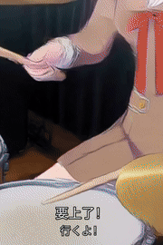

# Video ReGen Recipes

**一句话，本地，让 Agent 用 Minimax H3 复刻热点 MEME／鬼畜／手书视频。**

<!-- Template count is generated from profile.json files by scripts/catalog.py. -->
### 🎬 已收录 [11 个视频模板](templates/) · 持续更新

  
  
  
  

受够了在线平台的收费、版权、排队？
本仓库搜集各类二创模板，旨在降低本地视频门槛。通过可复用的模板与 Skills，教会你的 Agent 部署本地视频工作流，涵盖参考图、语音克隆、后期剪辑。

## 快速开始

  &nbsp;&nbsp;
  &nbsp;&nbsp;
  &nbsp;&nbsp;
  

下载完整仓库，在 Codex、Claude Code、Hermes Agent、OpenClaw 等 Agent 中打开项目，从[模板目录](templates/)选择一个模板，然后告诉它：

> 使用【模板名称】，用【角色或素材】制作视频。先读取对应的 SKILL.md，按模板完成素材准备、生成与剪辑。

Agent 会先询问你的意见，按需下载需要的模型，再一键生成二创视频。

## 文档导航

| 文档 | 内容 |
| --- | --- |
| [模板目录](templates/) | 选择模板、查看示例与验证状态 |
| [Agent 使用与适配](docs/agent-compatibility.md) | 接入方式与实测范围 |
| ComfyUI：[本地](docs/comfyui-local.md) / [远程](docs/comfyui-remote.md) | 部署、连接与文件传输 |
| [参考图 Skills](skills/) · [图片与声音](docs/assets-and-audio.md) | 准备角色图、场景与音频 |
| [H3 制作流程](docs/local-h3.md) · [工作流库](https://github.com/Shenrui-Ma/shenrui-comfyui-toolkit) | 本地视频生成与配套工作流 |
| [模板怎么写](docs/template-format.md) · [复现测试](docs/testing/README.md) | 贡献模板与维护者测试 |

## 配套资源

- [shenrui-comfyui-toolkit](https://github.com/Shenrui-Ma/shenrui-comfyui-toolkit)
- [Shenrui-Ma/video-regen-assets](https://huggingface.co/datasets/Shenrui-Ma/video-regen-assets)

## TODO

- [x] 内置参考图生成（ComfyUI、NovelAI、GPT-Image2）
- [x] 本地 MiniMax H3 及 ComfyUI 部署可复现
- [ ] 适配 Updream、Runway 等工具的 Computer Use 操作
- [ ] 完善 Windows 端测试
- [ ] 适配更多 Agent 产品，如 Trae、WorkBuddy

## 参与贡献

欢迎分享视频案例、提示词、工作流和复现经验，见[贡献指南](CONTRIBUTING.md)。

**维护者测试**：使用[复现测试提示词](docs/testing/reproduction.prompt.md)，严格按模板复现，避免 Agent 靠额外搜索或临时补救掩盖模板缺漏，并完整记录遇到的问题。欢迎提交测试反馈。

## 使用责任声明

使用者应确保所用素材及生成、传播的内容符合法律法规与公序良俗，不侵犯他人合法权益。因使用者违法、侵权或不当使用本项目产生的责任，由使用者依法承担，本项目作者及维护者不承担相应责任。

## 许可

原创代码与文档采用 [MIT License](LICENSE)。模型和第三方素材遵循各自许可。

<a href="https://space.bilibili.com/12595237"> Bilibili</a> · <a href="https://www.xiaohongshu.com/user/profile/68483ecb000000001b019555"> Rednote / 小红书</a> · <a href="https://civitai.red/user/Shenrui_Ma"> Civitai / C站</a>
