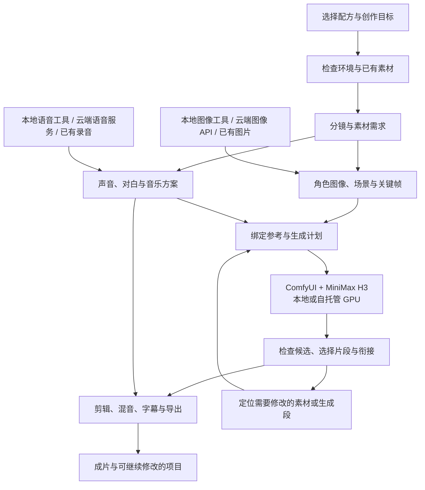

# Video ReGen Recipes

**把喜欢的视频，创作成你的版本。**

*Agent-ready recipes for anime video remakes, built around self-hosted MiniMax H3 generation.*


<sub>项目概念图，由 AI 生成，用于表达制作流程；不是 H3 成片样例。图像说明见 [assets](assets/README.md)。</sub>

一个面向二次元二创与自制番剧的 **Agent Skill 制作配方库**。将创作者公开分享的拍法，整理成可复用、可修改的完整流程：准备角色图像与声音，设计分镜与关键帧，生成视频，完成剪辑，并保留继续改片需要的素材与记录。

从你想做的视频出发，带上喜欢的角色，修改场景、台词、画风或表演。我们的目标是让 Agent 帮你补齐制作条件、连接工具、执行流程和处理常见返工，让更多时间留给创作。

**当前聚焦 ComfyUI + MiniMax H3 的本地／自托管视频推理。** 参考图、声音、音乐等辅助素材可以来自本地工具、云端 API 或你已有的资产。

> **项目状态：仓库初始化，首批模板整理中，暂无可直接运行的制作模板或 Skill。** 当前可浏览目录与编写规范、提交案例和参与模板整理；下文描述的是仓库的制作方向与交付标准。

[模板方向](#首批模板方向) · [制作流程](#从参考到成片) · [本地推理范围](#本地视频生成开放的辅助工具) · [浏览与参与](#浏览与参与) · [贡献配方](#一起把拍法留下来)

## 一份配方，留下完整的拍法

看到一条喜欢的视频，找到作者的提示词，往往只是开始。参考图该怎么准备、图号对应谁、工作流启用哪个分支、声音怎么安排、片段如何衔接，都影响最后的作品。

Video ReGen Recipes 想把这些容易散落在评论区、教程和工作流里的经验，整理到同一份配方中：

- **知道什么值得保留。** 说明这类视频成立的动作、节奏、风格或叙事规则，以及哪些部分可以改编。
- **按镜头准备素材。** 为角色、场景、声音、首尾帧与中间关键帧列出具体要求，并记录每次生成的参考绑定。
- **把工作流变成可复现的步骤。** 明确模型、节点、有效分支、输入与输出，让 Agent 有据可循。
- **把成功结果留下来。** 保存入选素材、候选片段、提示词和剪辑安排，为后续镜头修改与资产复用提供依据。
- **把失败经验也留下来。** 记录人物跑偏、声音不合适、动作失控和衔接不顺时的检查方法与已验证修复。

你可以把这里看作 **剧目库、角色工坊和 AI 剧组**：复用一种拍法，让自己的角色出演，再把故事继续改下去。

## 首批模板方向

先按想制作的视频寻找配方，再查看它需要的素材与推理条件。

| 方向 | 适合的作品 | 重点整理的制作经验 |
|---|---|---|
| [番剧对白与叙事场景](templates/anime-dialogue-scene/) | 日常对白、人物互动、多镜头剧情片段 | 人物与场景绑定、台词和声音、镜头组织、跨段连续性 |
| [角色主题短片](templates/character-short/) | 角色登场、情绪片段、围绕角色的短叙事 | 定妆与表演参考、构图、动作和节奏、镜头素材准备 |
| [液态形变与风格化 ED](templates/liquid-morphing-ed/) | 色块动画、连续形变、风格化片头片尾 | 画风、全局动势、关键形态、边界帧和剪辑连接 |

目录说明与收录状态见 [templates](templates/README.md)。每个方向都需要落实到具体案例与实测配方，支持的参考形式和可修改范围由实际工作流决定。

## 从参考到成片



模板按需使用这些环节。有对白的场景需要声音方案，纯视觉动画可以省略；某些声音用于模型参考，另一些留到剪辑阶段。首帧、尾帧、中间关键帧也按工作流实际支持的模式准备，并不意味着每次生成都能同时输入。

制作记录区分三件事：

| 对象 | 记录什么 | 修改时的用途 |
|---|---|---|
| **分镜** | 观众看到的构图、动作、对白与镜头关系 | 明确创作意图 |
| **生成段** | 一次实际推理的输入、配置、输出与候选 | 找到需要重新生成的范围 |
| **剪辑时间线** | 入出点、片段顺序、音轨、字幕与转场 | 检查修改如何影响最终作品 |

一次生成可以涵盖多个镜头，一段连续效果也可能由多个生成段拼接。局部改片需要检查相关生成段及相邻衔接，不能保证只改一个镜头就完全不影响其他内容。

## 本地视频生成，开放的辅助工具

这里的“本地”约束的是 **视频模型的推理位置**：由你控制的机器或 GPU 环境运行 H3，也可以是自己管理的远程服务器。

图像与声音可以根据效果、成本和现有工具自由选择。

| 环节 | 可采用的工具或素材来源 | 配方需要记录 |
|---|---|---|
| 角色与场景参考 | ComfyUI、NovelAI、GPT Image、已有图片 | 图像用途、身份特征、画风和版本 |
| 首尾帧与中间关键帧 | 本地或云端生图、已有画面提取与编辑 | 对应镜头、构图、姿态及受支持的输入方式 |
| 角色声音与对白 | 本地 TTS、云端语音服务、已有录音 | 音色、表演、文本、时长和用途 |
| 视频生成 | ComfyUI + MiniMax H3 | 模型、节点、工作流、运行配置与参考绑定 |
| 音乐、后期与导出 | 已有音频、合适的音频工具、FFmpeg 或剪辑软件 | 素材来源、时间线、音轨与导出设置 |

上表列出可采用的组合，实际接入随具体配方发布。无需为了一个模板准备所有工具。

H3 的推理条件随权重、量化、分辨率、时长和工作流变化。每份配方需要提供自己的设备与版本记录；仓库不以统一的显存、耗时或费用数字代替实测。

**本地 H3 推理也不自动等于完整流程离线。** 图像、声音、Agent 或可选的 Context-IR 预处理如果使用外部服务，配方会明确记录这些依赖。官方托管的 Regenerate-2K 涉及云端视频再生成，仅作为能力对照，不属于当前收录路线；首批模板的视频推理与所需后续视频生成均在本地或自托管环境执行。具体能力与模型使用条件以 [MiniMax H3 官方模型卡](https://huggingface.co/MiniMaxAI/MiniMax-H3) 为准。

接入边界见 [本地 H3 路线](docs/local-h3.md)，素材准备见 [图像与声音](docs/assets-and-audio.md)。

## 让角色资产持续出演

一次制作里选好的角色图像、服装和声音，应该能成为下一次创作的起点。

配方围绕可复用的角色资产组织：主要外貌与身份特征、需要的视角与表情、服装版本，以及可选的音色和说话方式。具体镜头再派生构图、姿态、光线和场景参考。

声音分别标记为 **临时配音、音色参考、最终对白、音乐或环境声**。图片分别说明身份、场景、风格或关键帧用途。这样，Agent 才能判断哪些素材可以沿用、哪些需要补做。

所有素材都要记录来源；用户的角色资产、音频、生成结果和服务凭证保存在自己的工作区。公开仓库只收录允许分发的示例和必要说明。

## 一份完整模板应该交付什么

模板的价值来自另一个人能否用自己的素材完成作品。我们按以下内容整理与验收：

| 内容 | 需要回答的问题 |
|---|---|
| 原案例与方法来源 | 拍法来自哪里，作者提供了哪些资料，哪些内容允许分发？ |
| 目标效果与修改范围 | 保留什么规律，能改哪些角色、场景、台词或表演？ |
| 素材清单与参考绑定 | 每个输入具体是什么，图号和声音对应哪个角色或镜头？ |
| 分镜与生成安排 | 哪些镜头由一次任务产生，时长和衔接如何处理？ |
| 推理工作流与环境 | 使用什么模型、节点、配置和服务，哪些分支实际启用？ |
| 剪辑与声音安排 | 怎样选片、裁切、配音、混音和导出？ |
| 复现与返修记录 | 在什么环境跑通，换了什么素材，出现过什么问题？ |

作者案例已收录、工作流可打开、一次推理成功、换角色后完成成片，是不同的进度。发布时会分别记录，避免把待验证的方法写成已经支持的功能。

详细约定见 [模板编写规范](docs/template-format.md)。

## 浏览与参与

克隆仓库：

```bash
git clone https://github.com/Shenrui-Ma/video-regen-recipes.git
cd video-regen-recipes
```

然后选择与你有关的入口：

1. **想找制作方法：** 浏览 [模板目录](templates/README.md)，查看正在整理的方向。
2. **已有 ComfyUI / H3 环境：** 阅读 [本地 H3 路线](docs/local-h3.md)，对照环境与工作流记录要求。
3. **擅长生图、声音或角色资产：** 阅读 [图像与声音](docs/assets-and-audio.md)，贡献可复用的准备方法。
4. **想贡献完整配方：** 从 [模板编写规范](docs/template-format.md) 和 [贡献指南](CONTRIBUTING.md) 开始。

Agent 接入将以 Hermes Agent 与 Codex 的实际制作流程为起点，逐步验证其他宿主。Skill 能加载、工具能执行、H3 能连接、完整模板能复现，将分别记录；当前 `skills/video-regen/` 是预留目录。

## 仓库结构

```text
video-regen-recipes/
├── README.md
├── CONTRIBUTING.md
├── LICENSE
├── assets/                      # 项目视觉与可分发的展示素材
├── docs/
│   ├── template-format.md       # 模板内容与验证约定
│   ├── local-h3.md              # 本地／自托管 H3 路线
│   └── assets-and-audio.md      # 角色、参考图与声音准备
├── templates/                   # 按视频效果组织制作配方
│   ├── anime-dialogue-scene/
│   ├── character-short/
│   └── liquid-morphing-ed/
├── workflows/comfyui/h3/        # 可分发的 H3 工作流
├── shared/                      # 跨模板共用的制作知识
├── skills/video-regen/          # Agent Skill 入口预留
└── examples/                    # 获准分发的示例与复现记录
```

模板呈现完整的制作路径，共用知识集中维护。使用一个角色短片模板时，只需加载它所依赖的资产、声音和工作流说明。

## 一起把拍法留下来

欢迎通过 [Issue](https://github.com/Shenrui-Ma/video-regen-recipes/issues) 提供想收录的案例，或通过 Pull Request 贡献整理成果。

- **分享案例：** 附原视频、作者教程或公开方法，以及你想复现的具体效果。
- **贡献一个环节：** 参考图准备、声音方案、镜头衔接、剪辑方法都可以独立贡献。
- **补齐制作配方：** 整理提示词、素材用途、工作流与实际步骤，保留来源和限制。
- **记录真实复现：** 附环境、修改内容、结果与失败处理；换一套角色后的经验尤其有价值。

每次贡献优先解决一个明确问题。不要提交私人素材、账号凭证或无分发许可的模型与作者文件。详见 [贡献指南](CONTRIBUTING.md)。

## 许可与致谢

仓库原创代码与文档采用 [MIT License](LICENSE)。模型权重、第三方工作流、视频、角色、图片、声音和音乐分别遵循其原有许可或使用条件，MIT 不覆盖这些第三方内容。

收录制作方法会保留创作者与资料来源。公开教程或网盘分享不自动意味着素材可被重新分发；需要保留外部获取方式的内容，将提供来源说明。

感谢愿意公开提示词、工作流与失败经验的创作者。让一次制作里摸索出的拍法，成为更多人下一次创作的起点。
