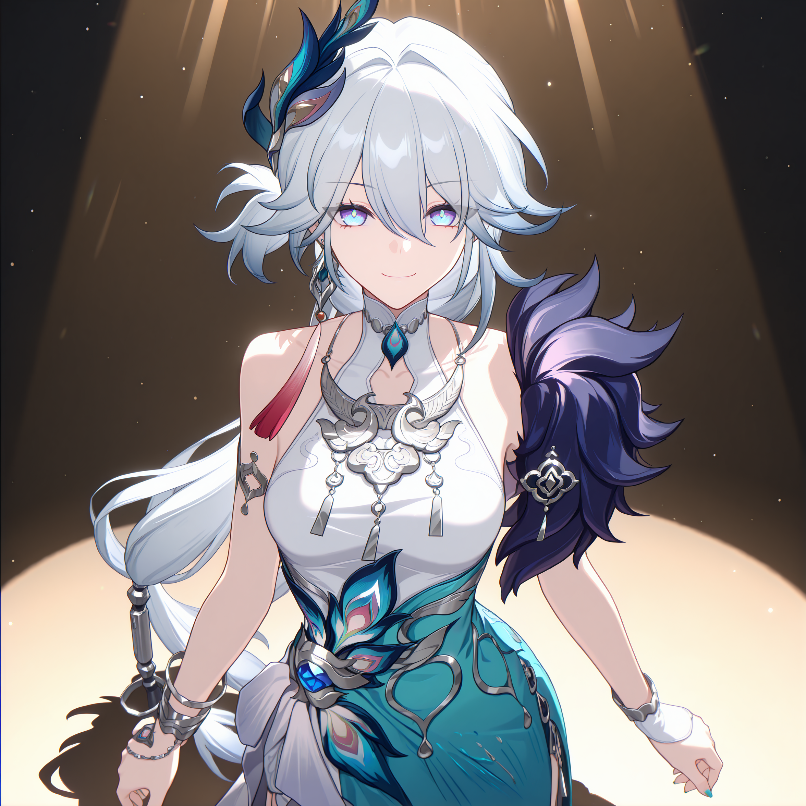

# 一点一滴刺痛我的心

原创配方：**Shenrui Ma（四倍体果蝇）**。

一句话开始：“用默认爻光素材制作这一支”，或“把人物换成我指定的角色”。默认素材已随模板提供，可以先重剪已有片段，也可以准备新角色后重新生成。

## 两种用法

| 你想做什么 | 从哪里开始 |
| --- | --- |
| 复用默认爻光画面，换音乐或重新导出 | [默认剪辑](references/editing.md)，不需要 H3 推理 |
| 换人物、服装或重新表演 | [让 Agent 执行](SKILL.md)，准备参考图后走本地 H3 |

已包含：爻光参考图、驱动视频、默认音乐，以及最终剪辑所选的四段爻光画面。[素材说明](assets/README.md)

## 制作链路

**角色图＋动作参考 → 四段 H3 原生 latent 续接 → 核对接缝 → 剪辑 → 替换完整音乐 → 可选超分、竖屏。**

默认剪辑为 **1344×768、60fps、1587帧、26.45秒**。60fps 来自帧率重采样；原生成画面为24fps。换角色后需重新检查接缝，不能照搬默认剪辑的裁帧数量。

[生成与续接](references/generation.md) · [剪辑与交付](references/editing.md) · [参数](profile.json) · [提示词](prompts/ref2va.template.txt) · [来源与验证](sources.md)

默认重剪有可用素材与脚本；新角色生成还需配置匹配的 H3 续接节点和模型。本次未重跑 H3 推理。
